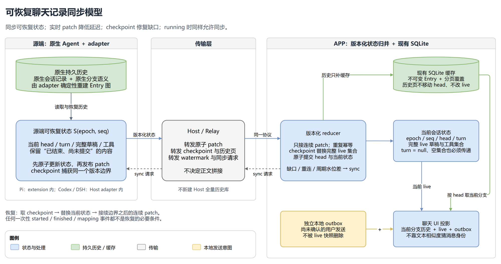

# ADR-0024：可恢复的会话状态同步

日期：2026-10-08

2026-10-10：[ADR-0025](0025-native-history-authority-and-versioned-caches.md) 替代本文的不可变缓存与同 ID 硬冲突条款。版本化历史页携带 source 所有权；原生权威修正通过新 epoch 与 APP 缓存事务生效。checkpoint/patch、running sync 和恢复调度继续遵守本文。

Status: accepted（设计已采纳；Codex 与 APP 分阶段实现，尚未完成全部后端及真实链路验收）

关联：[ADR-0013](0013-bounded-session-sync-and-shared-tree-ingestion.md)、[ADR-0023](0023-codex-revert-and-client-refresh.md)、[ADR-0008](0008-drop-backward-compatibility.md)。实施跟踪：[Issue #2](https://github.com/WGooold/Orbis/issues/2)、[Issue #3](https://github.com/WGooold/Orbis/issues/3)。

## 要解决的问题

2026-10-10：[ADR-0026](0026-host-selected-session-sync.md) 实现周期轻量核对，并让源端选择 preview 的实际内容。preview 不再每次固定下载 tail，完整 checkpoint、epoch 恢复和历史页职责仍遵守本文。

允许 running 时同步，而且在事件缺失、延迟、重复、断线、换路、回退之后，手机能重新得到正确的当前聊天状态。正确性不能依赖手机恰好收到了某一次 `started`、`finished` 或 ID mapping。

核心决定：**实时传输和 sync 复制同一份会话状态。实时事务用于低延迟更新，checkpoint 用于重新建立正确基线，历史页用于补齐不可变内容。**

本方案不增加 Host 全量聊天数据库。原生 Agent 保存持久历史；各 Agent backend 的源端 adapter 保存当前可恢复状态；手机沿用 SQLite Session Tree Cache。这里统一的是状态复制契约，不把 Pi tree、Codex revert、DSH fork 改造成同一种原生功能。



[可编辑图源](assets/0024-session-sync-model.drawio)

## 现有处理为什么不能只放开 running 限制

以下是设计时通过代码审查确认的处理路径；部分已由下述实施阶段修正，不表示每项均已完成真实链路复现：

| 现有处理 | 可能产生的具体问题 |
| --- | --- |
| `requestRuntimeRefresh` 在 running 或存在 streaming ID 时返回 | 漏掉结束事件留下的 overlay，会阻止用于修复它的 sync |
| sync 主要返回已提交 Entry，live 正文依靠收到的 delta 拼接 | 漏掉正文中段后，没有可读取的完整草稿来补上；只收到后缀也能被显示成普通消息 |
| preview/catchup 投影清理 active timing；`turn.finished` 先检查 timing，再处理 mapping | sync、重连、ctl 的 idle 提前到达，都可能使后到的映射被跳过 |
| remap 删除目标行；不同 ID 的实时/历史消息按正文等特征猜身份 | canonical 先到时可能被删除；残缺正文不能归并；相同短文本可能误归并 |
| 漏结束事件时保留 unfinished message/tool | sync 不携带完整 live 集合，不能证明哪些旧实时对象已经不存在 |
| 本地已覆盖 metadata leaf 时，catchup 可以直接结束 | metadata 漏收或 running 中 leaf 尚未发布时，刷新不一定真正查询源端 |
| 外层 sequence 按 runtime/channel 分配，包含其他设备的定向响应 | 本机看到数字跳号不一定丢了共享状态；发送时取号也不代表快照采集时点 |
| Codex 回放会参考旧内存顺序/parent，外部 revert 尚无完整协调流程 | 相同 Entry ID 可能被重建成不同内容；读取历史与新通知竞争，产生 conflict 或旧尾部复活 |

参考实现：[RemoteState.kt](../../android/app/src/main/java/dev/pi/remote/RemoteState.kt)、[RemoteViewModel.kt](../../android/app/src/main/java/dev/pi/remote/RemoteViewModel.kt)、[codex-runtime.ts](../../packages/host/src/codex-runtime.ts)、[host-service.ts](../../packages/host/src/host-service.ts)。

## 1. 一份状态，三类数据各有归属

每个 Session 的可复制状态记为 `S(epoch, seq)`：

| 数据 | 所有者与性质 | 手机如何使用 |
| --- | --- | --- |
| canonical Entries | 从原生持久历史确定性生成；同 ID 的 parent/type/timestamp/data 不变 | 存入现有 SQLite；按当前 head 的 parent 链投影 |
| current state | 源端 adapter 持有：当前 head、当前 turn、live 消息、工具状态 | checkpoint 整体建立基线，patch 原子推进；不写成未完成 canonical Entry |
| local outbox | 手机尚未确认的发送操作，使用 command/operation 身份 | 单独显示发送状态；不能被“源端 live 为空”删除 |

`live` 包括正在生成的消息，以及**已经结束、但尚未稳定进入 canonical 历史的消息**。Pi 的 message_end 可能早于持久 append；Codex 后面的 item 可能已完成，但要等前面的 item 才能确定提交顺序。它们在正式提交前必须仍可被 sync 恢复。

工具的 input/output、执行状态和所属 turn/message 同样是状态，不能只存在于事件里。终态工具在相关结果尚未 canonical 化时仍保留恢复信息。

源端先更新这份状态，再发送变化。对 Pi，这个状态位于 Pi extension/runtime bridge；仅放在 Host 不够，因为 Pi 到 Host 断线时现有 transport 会丢弃事件。Codex/DSH 的 adapter 位于 Host 进程内，但与通用 Host 路由职责分开。

**实时与历史分区必须互斥且完整：已观察、应显示的内容，要么在 live 中，要么已提交到当前历史中，不能因“结束了但未落盘”消失，也不能以两个身份长期重复出现。**

### 身份与提交

首版采用两种身份：`(epoch, liveId)` 标识临时对象，`(sessionId, entryId)` 标识 canonical 节点。不要求新增永久 live→Entry 映射库。

正常提交是一笔状态事务，例如：

```text
baseSeq = 41, seq = 42
addEntries = [稳定的 Entry E]
removeLiveIds = [临时消息 L]
currentHead = E
```

源端先把 `addEntries`、`removeLiveIds` 和 `currentHead` 作为一个状态版本提交，再发布这个版本。手机收到后，在一个本地事务中校验并写入 Entry，同时切换 head、live 和复制游标；UI 不观察事务中间状态。手机写库失败不会改变源端 seq，重试 checkpoint 时已写入的同内容 Entry 幂等复用。

丢失这笔事务时，checkpoint 会带来权威 head、完整 live 集合和所需历史引用：旧 L 不在 live 集合中就退出源端 live 层；E 通过 tail 或后续历史页取得。没有 E 的内容时显示加载缺口，不能保留 L 冒充最终消息。稳定跨阶段 messageKey 可改善动画和滚动连续性，但不是恢复正确性的前提。

本地 outbox 不在上述替换范围内。若需要自动消除发送确认丢失造成的 pending 行，须能按已有 command/operation ID 查询可重取的提交结果。没有这一能力时保留“发送结果待确认”，不猜正文匹配、不自动重发；本方案不据此承诺用户命令恰好执行一次。

## 2. 每个 Session 只有一条状态版本序列

所有影响聊天画面的共享状态事务携带：

```text
session identity（沿用当前 Host/Runtime/Session 路由归属）
sourceEpoch
baseSeq
seq
changes
```

- `sourceEpoch` 标识这份源端复制状态的生命周期。adapter 丢失无法连续衔接的内存状态、重建实例时更换；普通网络重连不必更换。
- 新 epoch 只有在 adapter 已经从原生 Agent 完成历史与运行态核对后才进入 `sourceReady=true`。核对尚未完成时可以建立连接，但只能发送 `sourceReady=false` 的未知/部分 checkpoint；不能用旧内存 head 或旧 live 冒充新 epoch 的权威状态。
- `seq` 在源端更新状态时产生。它覆盖 head、turn、live 正文、工具状态、commit、已确认的 revert；定向历史响应、心跳、请求回执不递增它。
- 所有订阅者看到同一套状态事务。一个事务可以批量合并连续变化，用 `baseSeq → seq` 表示覆盖区间；不能省掉中间变化却沿用原来的连续前置版本。
- 正文 append 只有在本地版本恰好等于 `baseSeq` 时才能执行；对不存在的对象不能盲目创建后缀。最初创建带完整实体，后续可带 delta，也可用完整实体 upsert。
- turn、工具完成、计时信息不再依赖另一条通知先到。ctl 上的运行状态可用于目录提示，不能清除这套状态中的 turn、live 或映射。

状态事务可附带有界的不可变 `entries`（最多 256 个，Codex adapter 将整个事务限制在正常页预算内）。手机复用 canonical ingestion 校验并提交 SQLite 后，才整体应用该版本的 head/live；正常 commit 因此不会先删除 live、再等待另一轮 preview。超预算时不截断 Entry，继续通过 checkpoint/pages 恢复；乱序事务中的节点可以补缓存，但不能绕过版本门槛移动当前状态。该字段是协议 v9 的可选补充，缺省仍使用原有恢复路径。

外层加密/传输 sequence 继续服务现有传输安全与调度；不拿它充当 `seq`，也不放松现有重放保护。

同 epoch 的旧事务幂等忽略；未来事务存在缺口时缓冲并恢复。不比较 UUID 的大小来判断 epoch 新旧：只有当前连接/恢复任务确认的源端握手能建立新 epoch，旧任务响应不能把 epoch 切回去。

## 3. checkpoint 是可独立恢复的基线

checkpoint 不是“若干历史 Entry 加几个临时事件”。它必须提供同一源端状态时点的：

```text
sourceEpoch, seq
currentHead + headCompleteness
sourceReady
currentTurn（已知的 turn、明确为空，或明确未知）
liveMessages（累计正文、状态、所属 turn）
tools（完整当前集合及可恢复的 input/output/state）
live inventory completeness
固定 currentHead 的历史 tail 页或读取引用
```

只有 `sourceReady=true` 且 `headCompleteness=complete`、`inventoryComplete=true`，才允许把 live 列表中的缺席解释为源端对象已退出，或把 checkpoint 的 head 切换为当前 head。空集合也必须携带这个事实。集合完整与正文完整不同：晚接入时可能知道当前消息存在，却拿不到已生成前缀，此消息须有 `contentComplete=false`。未知不能编码成空 head、空 turn、空文本或 idle。

partial checkpoint 必须明确未知范围。手机可显示“正在恢复”或“不完整正文”，不能把旧对象继续当作已验证的 running，也不能把未知的结束状态判成完成。`inventoryComplete=false` 时只能更新列出的对象，并保留未列出对象为 unknown；不能整体替换 live 集合。`contentComplete=false` 的对象在取得完整正文或 canonical 结果前不应用后续 delta，除非协议同时提供并验证 `contentRange/knownPrefix`；首版直接要求完整正文再继续。

adapter 在自己的串行状态提交边界捕获 immutable checkpoint 引用，随后异步编码/发送；不能分别读 head、正文和 turn 后拼出一个声称原子的版本，也不能等发包时才给版本号。

### 手机的应用规则

1. 打开会话、重连、显式刷新或发现缺口时，建立有归属的恢复任务，先接收并有界缓冲后续事务，再请求 checkpoint。源端订阅建立与采集边界之间不能存在无人接收的窗口。
2. 校验请求、Session、连接和 epoch 归属；校验并事务写入附带的不可变 Entries。
3. 若 checkpoint 比本地同 epoch 已应用版本旧，不用它回退 current state。有效不可变节点可以按任务归属单独入库；不保留两个争夺当前状态的写入入口。
4. 只有 `sourceReady=true` 且 head/inventory 完整时，checkpoint 才整体建立 head/turn/live/tools 基线，并丢弃缓冲中 `seq <= checkpoint.seq` 的旧事务。部分 checkpoint 只能更新明确标记为已知的字段，不能清除未知对象或切换未知 head。
5. 只顺序应用 `baseSeq == 本地seq` 的事务；事务也必须属于已确认的 source epoch。缺口仍在、发生重叠批次却不能证明可应用、或缓冲超限时，重新 checkpoint，不直接拼接剩余 delta。

可见状态只有“已确认到某版本”和“等待恢复”的区别，`running` 本身不影响这些规则。

### 一个缺失中段的例子

```text
手机已确认 v20，正文是“你好”。
v21（追加“，世界”）在断线期间丢失。
v22（追加“！”）到达，要求 baseSeq=21。
手机发现本地只有20，暂存22，发起恢复，不生成“你好！”。
源端捕获 checkpoint v24，累计正文是“你好，世界！今天”。
手机等待响应期间收到25、26，暂存。
应用v24，丢弃<=24的缓冲，再应用连续的25、26。
```

反过来，如果手机已经连续应用到 v26，旧 checkpoint v24 才到，则不让画面倒退。若 finish/commit 全部丢失，恢复直接得到最终 Entries 和新的 live 集合，无需重播那些通知。

## 4. 历史分页只补缓存，当前状态只随版本提交

保留现有有界 `session.sync` 入口与统一 Entry ingestion。协议上明确区分状态 checkpoint 与历史 page；可以共用一个命令的不同目的参数，不能再让 `replace/append/prepend` 隐式决定当前运行态。

首版命令范围固定为：`preview` 返回当前状态 checkpoint 及有界 tail；`history` 和 `catchup` 仅返回 canonical page，不携带当前 source/head/live checkpoint。page 的 cursor 描述请求目标，不具有切换当前 head 的权限。新 head 尚未缓存时请求 preview 或缺失范围，不能用 catchup 到达顺序决定当前分支。

- 当前 head 只由 checkpoint/状态事务决定。历史页携带固定 `targetLeaf`、anchor、任务归属和 coverage，只补节点及连续覆盖事实。
- 分页响应不会清 turn、结束工具、合并 live、移动当前 head。旧页即使晚于 revert 到达，也不能把当前聊天切回旧尾部。
- 失去有效任务归属的页丢弃。合法旧目标页是否继续缓存，由有界后台任务明确决定；缓存旧分支从来不等于切换当前分支。
- target 已被原生 revert 删除且源端无法提供时，返回 `stale_target`，取消旧目标后续页并重新 checkpoint；不能偷偷把目标换成新分支却沿用旧任务。
- 缓存没覆盖当前 active path 时显示缺口并补页，不能拿“缓存里最后一条”替代权威 head。

首屏建议从最多 **30 个 Entry** 开始，后续按可见窗口补页。这只是初始可调参数；同时保留 ADR-0013 的正常页 256 KiB、完整响应 1 MiB 硬上限。条数无法约束一个超大工具输出，因此只把 100 改成 30 不是恢复机制。

live checkpoint 同样有预算：小状态单响应返回；大状态在固定 `(epoch,seq,checkpointId)` 下分块，全部校验收齐后才整体应用，不能把某一块当完整集合清掉其它草稿。固定采集结果在有界期限内保留；过期明确重取。这个 checkpointId 是响应装配身份，不是第三种会话版本。

首版仍按 ADR-0013 对单个超出 canonical 响应硬上限的 Entry 明确失败，不静默截断。要支持更大的单 Entry，需另行决定内容分块或附件引用；收敛保证的支持范围须包含这些资源上限。工具/正文展示裁剪也不能让裁剪结果冒充完整权威内容。

## 5. 缺口触发恢复，周期对账兜住静默缺失

只看跳号发现不了“最后一个 finished 丢了，之后再无事件”。必须保留主动恢复路径：

- 进入会话、回到前台、重连/换路后，以及手动刷新，查询当前源端状态；不能因本地 metadata leaf 已覆盖就省略这一步。
- 前台每 15 秒发起轻量 watermark 探测，复用当前已有定时入口。返回源端 `(epoch,seq)`；与本地不同就恢复。具体频率可按带宽调整，不依赖 idle/running。
- 每个 Session 同时只允许一个恢复任务，有界缓冲、请求合并、退避和背压；超时保留旧画面并说明待恢复，不能持续制造重复大快照。

**对账必须覆盖两段：原生 Agent → adapter，以及 adapter → 手机。** 只返回 adapter 内存里的 seq，修不了 adapter 自己漏掉的原生 `thread/reverted` 或 turn 完成通知。

因此源端在重新附着、原生连接重建、相关通知或周期核对时，查询原生当前历史及可恢复运行态。原生提供可靠 revision/cursor 时优先比较；没有时用可验证的读取结果核对。不能只比较 head ID，因为 running 的正文、工具、turn 状态可以变化而 head 不变。手机可以频繁取轻量 watermark，adapter 原生读取合并调度，但必须保证前台持续连接时定期真正核对来源。

不假设健康 TCP/WebSocket 在同一连接上任意乱序；要覆盖的是断线窗口、切路、应用转发缺失、跨通道延迟及迟到响应。恢复算法不依赖“这些情况一般不会发生”。

## 6. revert 是状态事务，不是修改同一个 Entry

源端 adapter 把手机发起的成功 revert 与外部原生 revert 通知汇入同一个历史协调流程：

1. 为异步读取建立本地协调代次，按 Session 串行提交结果；新 revert/turn 使旧读取过期，通知在核对期间有界缓冲。
2. 读取并确定性重建原生保留历史，核对当前 head、turn 和 live。顺序、parent、时间、data 不能依赖上次内存内容或本次读取时间。
3. 确认后用新的状态版本一次性发布 head 和完整当前 live/turn/tools。旧 canonical 节点可以留在手机缓存，但不再属于当前分支。
4. 旧 patch 因版本/epoch 被丢弃，旧历史页没有切换 head 的权限。adapter 必须依据原生 turn/item 归属排除旧轮次迟到通知，不能替它们重新分配较大 seq 再接回旧内容。

按 ADR-0025，Codex revert、共享节点修正或旧尾部删除建立新的缓存 epoch；纯追加只推进 seq。Entry ID 保持原生身份，但已验证原生历史可以修正旧 parent/data。新 epoch 必须通过 APP 的接受检查与缓存事务生效；不能按到达顺序覆盖。未版本化路径继续使用原有不可变规则。

锁只能串行化本 adapter 的工作，不能锁住外部 GUI/TUI。若原生接口没有一致快照或可校验 revision，分页读取必须结合通知缓冲、边界重读和过期结果作废；不能把未经核对的混合历史提交为新基线。无可靠核验手段时标记正在协调，在源稳定后重新读取，不能宣称每次读取都具备全局原子性。

running 时允许 sync 不意味着 running 时允许 revert；后者仍按原生能力及 ADR-0023 的操作条件处理。Codex 原生 GUI/TUI 内存 transcript 的刷新仍属于 ADR-0023，这套 Orbis 协议本身不能强制第三方客户端重新渲染。

## 收敛保证与能力边界

在网络最终能够完成一次 checkpoint 及所需历史页传输、源端状态仍可读取、变更速率不持续超过处理能力、内容处于支持的资源上限内时：

1. checkpoint 直接把手机恢复到某个已确认的 `S(epoch,seq)`，不依赖此前事件是否齐全。
2. 每次后续事务只从匹配的 base 版本应用，保持状态连续；不匹配就回到 checkpoint。
3. 缺口检测处理显性缺失，周期对账处理最后一条事件消失以及漏掉原生通知。
4. 来源稳定后，手机最终得到同样的 active head、canonical 正文、live 集合、turn 和工具状态；未加载范围明确为缺口，不伪装成完整。

无需无限事件日志、逐包 ACK、永久 mapping 日志、正文相等匹配、全量历史 digest 或新的 Host 聊天库。有限事件回放可作为以后节省带宽的优化，不是首版正确性前提。

这里有不可由协议创造的数据：Codex 晚接入进行中的 turn 时，原生 API 可能不提供之前正文，而 adapter 从未收到它。此时只能明确不完整，并在完整 item/持久历史可读后补齐。若要求进程崩溃后也恢复原生不持久化的每个 token，额外需要源端 live checkpoint 持久化或原生恢复 API，单加手机数据库做不到。

同样，原生 revert 已删除、所有现存缓存都没有的旧分支，不能承诺以后在新设备恢复。若产品要求永久保留所有旧分支，才需要额外的历史留存职责。这与修复当前分支同步是不同要求。

## 最小实施范围与现有决定的变化

| 模块 | 必须改变的职责 |
| --- | --- |
| Protocol | strict checkpoint/patch/page schema、状态版本、完整性声明、硬版本升级；沿用现有路由和加密 |
| Pi extension | 在网络发送之前累计当前消息/工具/turn；从 SessionManager 核对持久化边界；提供可重取 checkpoint |
| Codex adapter | 累计 live；确定性重建 canonical；统一外部/内部 revert 协调；晚接入未知内容显式表示 |
| DSH adapter | 复用已有累计 stream 状态，将完整 turn/tool/live 纳入 checkpoint；保留原生 fork 语义 |
| Host/Relay | Host 保留定向响应、去重背压及状态事务转发；Relay 继续转发不透明密文，不接管 Session 语义 |
| APP reducer | 单一版本化状态入口；完整恢复替代正文猜合并/一次性 mapping；outbox独立；取消 running sync 禁令 |
| APP SQLite / ingestion | 按 ADR-0025 校验权威版本与结构、事务更新缓存和 coverage；历史页面不直接控制当前 head 或运行态 |
| APP sync scheduler | checkpoint 恢复与历史补页分责；前台周期源端探测真正发请求；有界缓冲与单任务合并 |

保留 ADR-0013 的原生身份、统一写入、连续覆盖、分页预算、定向返回和背压。同 ID 与旧缓存的差异按 ADR-0025 处理。当前状态由版本化 checkpoint/patch 决定，mode 只描述历史范围；旧任务仍遵守严格归属。

实施顺序：先确定源端可恢复状态和 canonical 稳定性，再接入 checkpoint/patch 与 APP 单一 reducer，最后启用 running sync 和自动恢复。不能先删 guard，再把已经发生的损坏逐个补回来。

遵循 ADR-0008 同步升级相关组件与硬协议门槛，不维持一套新旧事件共同决定聊天状态的隐式兼容路径。一个 Session 建立 source checkpoint 后，聊天状态仅随版本化 checkpoint/patch 更新；旧 message/turn/tool 事件和 metadata 不得绕过版本检查。

## 实施进度与启用范围

- Protocol 已升级到版本 10，校验完整 source/checkpoint/live envelope、显式 head 和 patch 版本边界；状态 checkpoint 只由 preview 返回，history/catchup 携带 source 所有权。
- 首阶段接入 Codex adapter 和 APP reducer。APP 在建立版本化基线后隔离旧生命周期事件；Pi 与 DSH 尚未提供这套 source 状态，仍使用其原有同步路径，不能据此宣称它们已满足本 ADR 的恢复保证。
- Codex 的确定性重建、协调代次与版本化 live/checkpoint 已有实现和单测。原生通知的 canonical 提交及 live/tool 移除作为一次状态事务发布；每 15 秒、重新 announce 以及到期 preview 核对原生 `thread/turns/list`，可以发现静默回退和遗漏的完成通知。首版会读取完整 turns，长会话和多会话的读取成本仍需优化；原生多页没有 revision token 时要求连续读取一致，不把无法确认的结果发布为 ready。
- APP 已实现缺口恢复、完整 checkpoint 后重放连续 patch、history/catchup 只补缓存和旧生命周期隔离。SQLite 版本 7 按 ADR-0025 持久化缓存 epoch/行 seq 并允许权威修正；保留旧 Codex 表示迁移记录，非法结构仍整批失败。
- Codex GUI/TUI 自动刷新由 ADR-0023 / Issue #4 跟踪。刷新协调器和持久 journal 不等于生产 driver 已接入，也不等于真实 GUI 已完成 hydration。
- 单测覆盖和真实链路验收分别记录；尚未完成的 Pi/DSH 接入、大 checkpoint 分块、旧缓存迁移的设备验证及设备断连验收继续保留为明确限制。

## 故障注入验收

最终判据是手机状态投影等于已确认的源端状态，而不是仅检查某个事件 handler 是否被调用。至少覆盖：

| 注入场景 | 必须得到的结果 |
| --- | --- |
| 丢 started、前缀或中段 delta | 缺口触发恢复；完整草稿可取时正文补齐，拿不到时明确不完整 |
| 丢最后一个 finished/commit/idle，之后无事件 | 周期核对后最终消息及运行态正确，工具不永久 running |
| Pi 到 Host 断线，手机到 Host 始终正常 | 从 Pi 源端 checkpoint 恢复，不拿 Host 未收到的事件缓存冒充完整状态 |
| 丢全部 mapping，canonical 先于完成通知出现 | 一个 canonical 结果，旧 live 退出，不按文本猜身份 |
| checkpoint v24 延迟，本地已到 v26 | 不回退；从 v24 恢复的客户端只重放连续的后续事务 |
| 重复/延迟 patch、旧 epoch 响应、切路 | 不重复拼接、不复活旧 turn，不凭任意迟到 epoch 切换源 |
| ctl idle 先于 msg finish | 不删除 live/timing 身份，不依赖跨通道先后完成提交 |
| running sync；读页期间新增 turn；旧页在 revert 后到 | 运行态连续，分页不倒退 head、不清 live |
| Host/adapter 重建，旧 live 与新 epoch 共存于网络 | 新握手建立基线，旧 epoch 不复活；原生未知前缀明确标记 |
| 原生 revert 通知缺失；原生运行态变化但 head 不变 | 源端周期权威对账发现差异，手机恢复到新状态 |
| revert 读取期间外部启动新 turn/再次 revert | 过期读取不提交，不把旧 item 接回新历史 |
| 权威重建修正同 ID 的 parent/data | 新 epoch 通过 checkpoint 事务修正缓存；旧响应不覆盖，非法重复/循环仍回滚 |
| 超大 checkpoint、分块丢失、慢链路、缓冲超限 | 不应用半份完整集合；资源有界，恢复可重试，不无限积压 |
| 手机崩溃于 Entry 入库后、内存 seq 更新前 | 重启 checkpoint 后幂等恢复，不依赖未持久化的 live/seq |
| outbox 确认丢失、另一设备收到定向页 | pending 不被 live 替换删除；定向响应不制造共享版本假缺口 |

需要 reducer/adapter 故障测试、Android SQLite 事务验证及真实链路断连/延迟验证。当前已执行部分 Protocol、Codex adapter、Android reducer 和刷新恢复单测；全部故障矩阵及真实 GUI/TUI、设备链路验收尚未完成，不能将单测通过视为全流程完成。
